# Netflix — AWS ALB Path-Based Routing

A Netflix-inspired multi-service web app deployed on AWS using Application Load Balancer path-based routing. Each section of the site runs on a **dedicated private EC2 server** — traffic is routed by the ALB based on the URL path.

Built as a hands-on project during **DevOps Bootcamp** to demonstrate real-world ALB path-based routing architecture on AWS.

> **Live demo was running at:** `http://alb-netflix-521888888.ap-south-1.elb.amazonaws.com`

---

## 🎬 The App

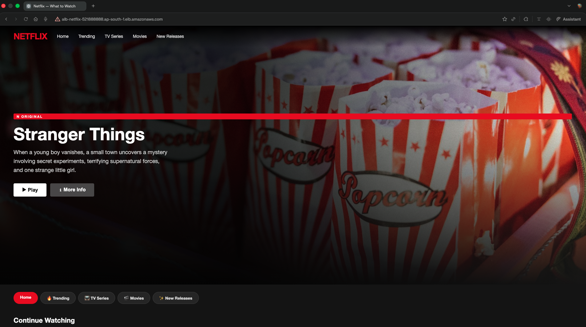

A fully functional Netflix clone with 5 independently deployed sections, each served by a dedicated EC2 instance in a private subnet — routed by a single Application Load Balancer.

---

## 🏗️ Architecture


```
User → ALB DNS (alb-netflix-521888888.ap-south-1.elb.amazonaws.com)
           │
           ▼
  Application Load Balancer (internet-facing)
  Spans: ap-south-1a + ap-south-1b + ap-south-1c
           │
    ┌──────┼──────┬──────────┬────────────┐
    ▼      ▼      ▼          ▼            ▼
  path:/  /trending /series  /movies    /new
    │      │      │          │            │
  TG-home TG-trending TG-series TG-movies TG-new
    │      │      │          │            │
  EC2-1  EC2-2  EC2-3      EC2-4        EC2-5
  AZ-1a  AZ-1b  AZ-1b      AZ-1c        AZ-1c
```

---

## 📋 AWS Resources

| Resource | Name | Details |
|---|---|---|
| VPC | netflix-vpc | 10.0.0.0/16 |
| Public Subnets | 3 | 1a, 1b, 1c — for ALB nodes |
| Private Subnets | 3 | 1a, 1b, 1c — for app servers |
| Internet Gateway | netflix-igw | Attached to VPC |
| NAT Gateway | netflix-regional-nat | Regional mode — all AZs |
| EC2 Instances | 6 | 1 bastion + 5 app servers (t3.micro) |
| Target Groups | 5 | tg-home, tg-trending, tg-series, tg-movies, tg-new |
| Load Balancer | alb-netflix | Application, internet-facing, HTTP:80 |

---

## 🎬 Services & Routing Rules

| Path | Target Group | EC2 | AZ | Content |
|---|---|---|---|---|
| `/` (default) | tg-home | ec2-1-home | ap-south-1a | Homepage |
| `/trending` | tg-trending | ec2-2-trending | ap-south-1b | Trending Now |
| `/series` | tg-series | ec2-3-series | ap-south-1b | TV Series |
| `/movies` | tg-movies | ec2-4-movies | ap-south-1c | Movies |
| `/new` | tg-new | ec2-5-new | ap-south-1c | New Releases |

---

## 📸 Screenshots

### VPC Resource Map
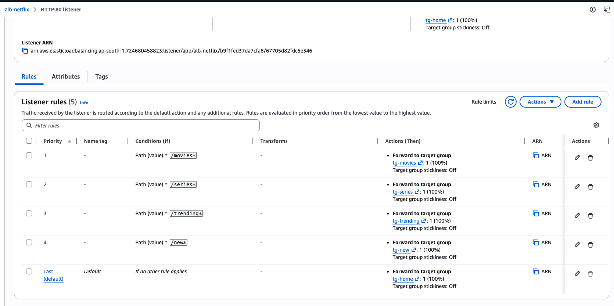

### Subnets — 3 Public + 3 Private across 3 AZs
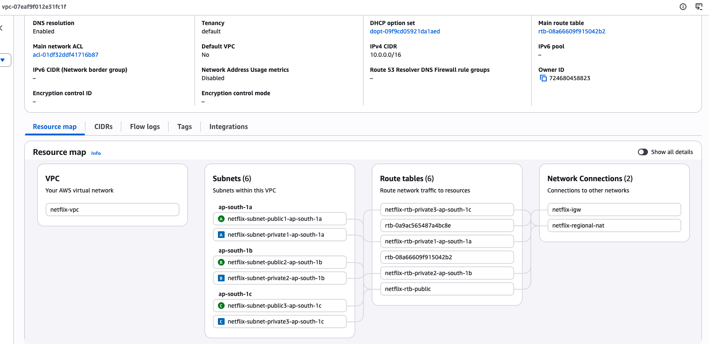

### EC2 Instances — All 6 Running
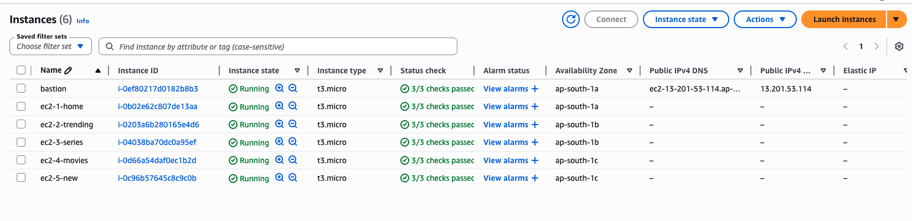

### Target Groups — All 5
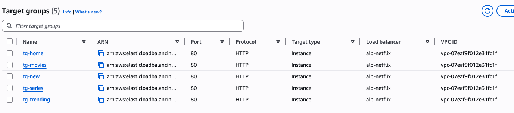

### ALB Details — Active, 3 AZs
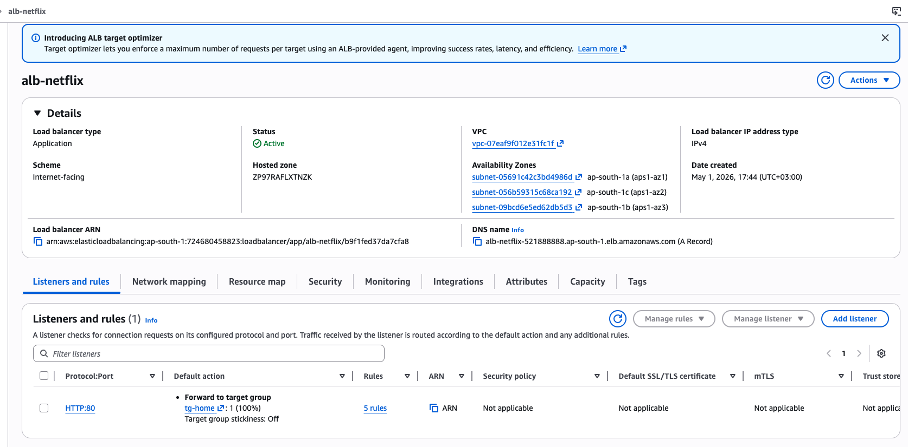

### ALB Listener Rules — Path-Based Routing
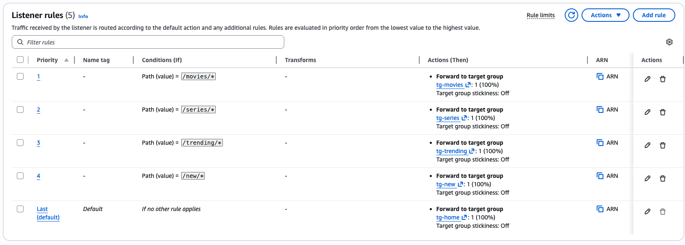

### Homepage — Served via TG-home


### Trending — Route: /trending → TG-trending
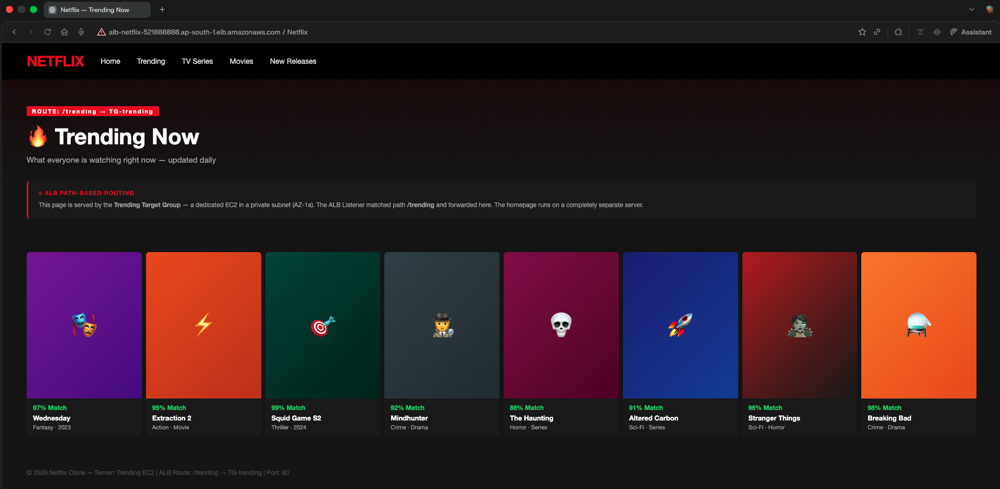

### TV Series — Route: /series → TG-series
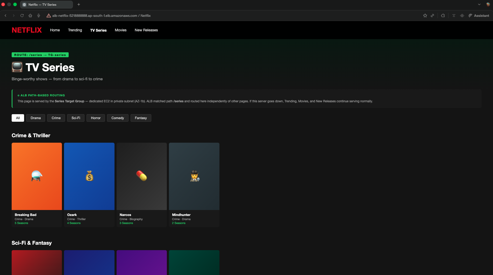

### Movies — Route: /movies → TG-movies
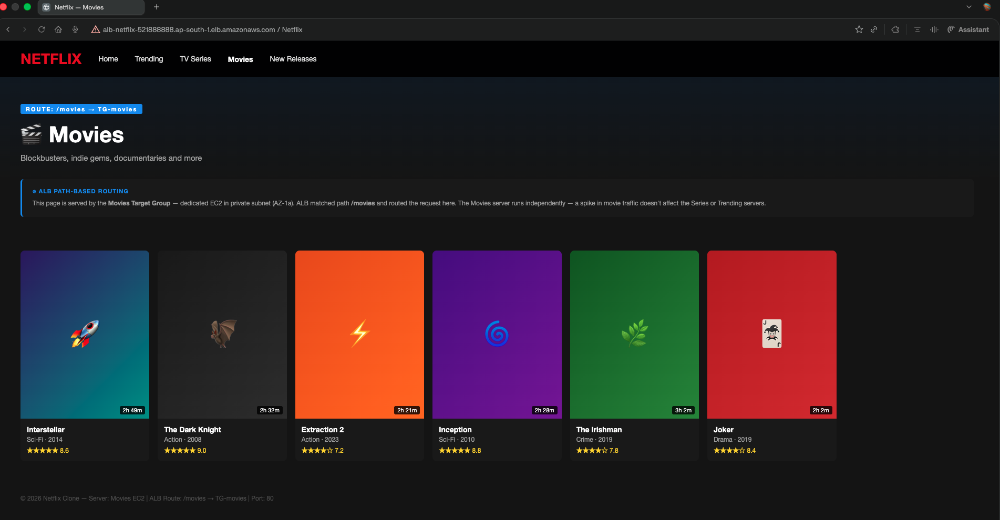

### New Releases — Route: /new → TG-new
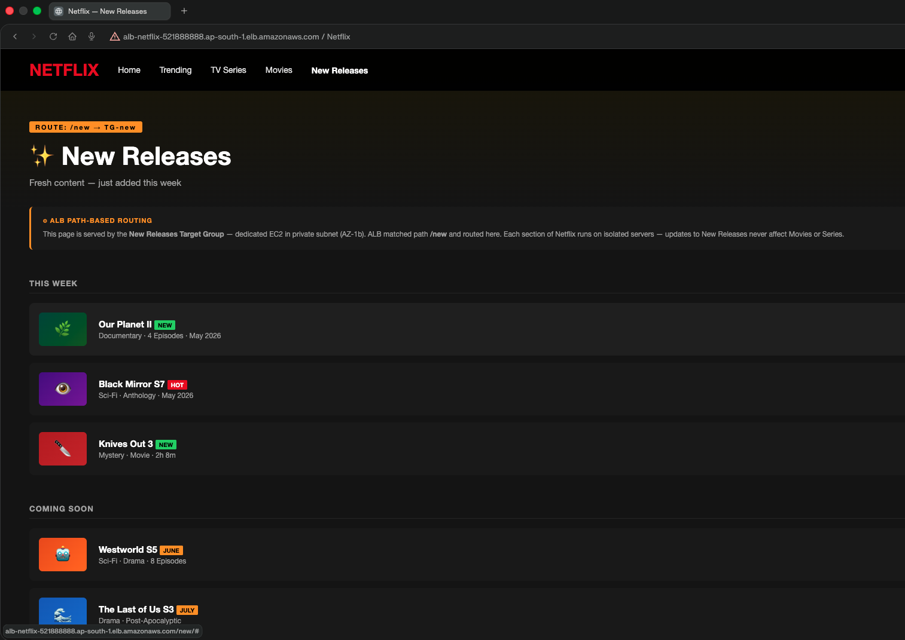

---

## 🚀 Deployment Guide

### Step 1 — Clone this repo
```bash
git clone https://github.com/abishaix/netflix-path-routing-aws.git
cd netflix-path-routing-aws
```

### Step 2 — Build AWS Infrastructure
1. Create VPC `10.0.0.0/16` with 3 public + 3 private subnets across 3 AZs
2. Attach Internet Gateway
3. Create Regional NAT Gateway in a public subnet
4. Configure route tables — public subnets → IGW, private subnets → NAT
5. Create Security Groups

### Step 3 — Launch EC2 Instances
- 1 Bastion Host (public subnet, public IP enabled)
- 5 App servers (private subnets, no public IP)
- All t3.micro, Amazon Linux 2023

### Step 4 — Deploy Content to Each Server

SSH via bastion, then on each server:
```bash
sudo su -
yum install nginx -y
systemctl start nginx
systemctl enable nginx
```

Deploy content:
```bash
# Home server
vi /usr/share/nginx/html/index.html

# Trending server
mkdir /usr/share/nginx/html/trending
vi /usr/share/nginx/html/trending/index.html

# Series server
mkdir /usr/share/nginx/html/series
vi /usr/share/nginx/html/series/index.html

# Movies server
mkdir /usr/share/nginx/html/movies
vi /usr/share/nginx/html/movies/index.html

# New server
mkdir /usr/share/nginx/html/new
vi /usr/share/nginx/html/new/index.html
```

### Step 5 — Create Target Groups

For each service:
- Type: Instances, Protocol: HTTP, Port: 80
- Health check paths: `/` , `/trending`, `/series`, `/movies`, `/new`
- Register the correct EC2 in each TG

### Step 6 — Create Application Load Balancer
- Scheme: Internet-facing
- Select all 3 public subnets (one per AZ)
- Listener: HTTP:80 → default action: tg-home

### Step 7 — Add Path Rules to Listener

| Condition | Action |
|---|---|
| path = `/movies*` | Forward to tg-movies (100%) |
| path = `/series*` | Forward to tg-series (100%) |
| path = `/trending*` | Forward to tg-trending (100%) |
| path = `/new*` | Forward to tg-new (100%) |
| Default | Forward to tg-home (100%) |

### Step 8 — Update ALB DNS in HTML

Replace `ALB_DNS_NAME` in all HTML files with your actual ALB DNS, then redeploy.

---

## ⚠️ Important Notes

- **Health check paths must match content directories** — if content is at `/trending`, health check path must be `/trending`, not `/`
- **ALB path rules use wildcard** — use `/trending*` not `/trending/` to match both `/trending` and `/trending/`
- **Default action = tg-home only** — do not add other TGs to the default action, only add them as path rules
- **NAT Gateway costs ~$0.045/hr** — delete after lab to avoid charges

---

## 🧹 Cleanup Order

1. Load Balancer
2. Target Groups
3. EC2 Instances (all 6)
4. NAT Gateway
5. Release Elastic IPs
6. Security Groups
7. Route Tables
8. Subnets
9. Internet Gateway (detach first)
10. VPC

---

## 💡 Key Concepts Demonstrated

- **ALB path-based routing** — one LB, 5 services, each on dedicated server
- **Private subnet deployment** — app servers have no public IP
- **Target Groups** — isolate which servers receive traffic per path
- **Health checks** — path-specific, not server-wide
- **Fault isolation** — one service down doesn't affect others
- **Regional NAT Gateway** — private servers reach internet for installs

---

## 📁 Repo Structure

```
netflix-path-routing-aws/
├── index.html              ← Homepage
├── trending/
│   └── index.html          ← Trending Now
├── series/
│   └── index.html          ← TV Series
├── movies/
│   └── index.html          ← Movies
├── new/
│   └── index.html          ← New Releases
├── diagrams/
│   └── Netflix-Path-Routing-AWS-v2.drawio.svg
└── screenshots/
    └── *.png

```

---

## 🔗 Connect

- GitHub: [abishaix](https://github.com/abishaix)
- LinkedIn: [linkedin.com/in/abimxai](https://linkedin.com/in/abimxai)

---

*Built during DevOps Bootcamp — Week 3 | Region: ap-south-1*
